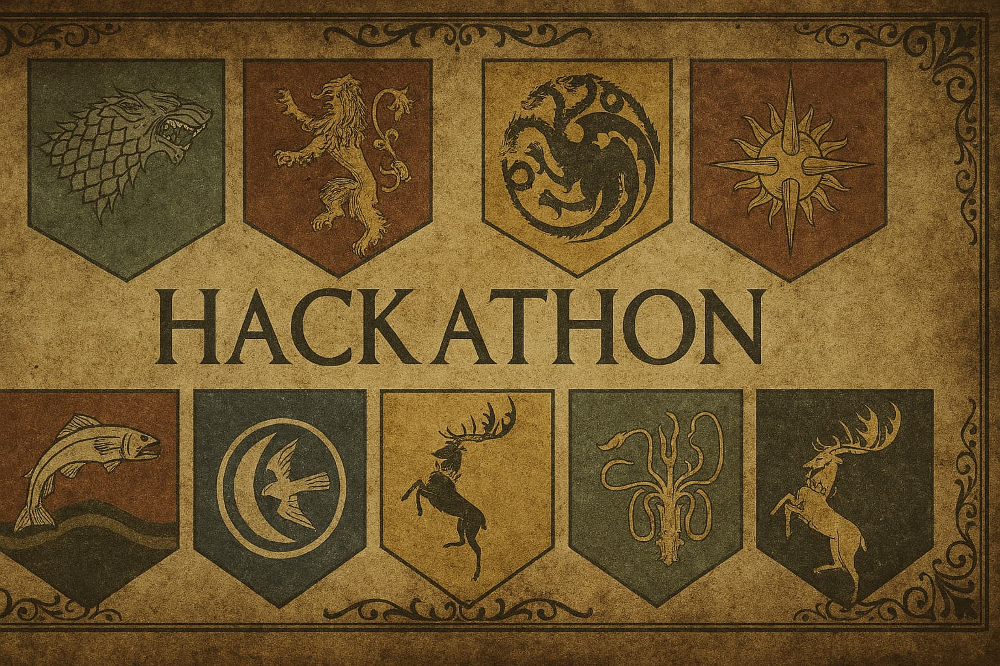

# 🏆 Hack of Thrones: Game of Thrones Hackathon Website

Welcome to the official website for the **Hack of Thrones** — a Game of Thrones-inspired hackathon! This site is built with Next.js, React, and Tailwind CSS, and features a beautiful, immersive design to get you excited for the event.



---

## 🚀 Features

- **Hero Section**: Striking Game of Thrones-inspired landing with call-to-action buttons.
- **About**: Learn more about the hackathon's theme and mission.
- **Timeline**: See the event schedule at a glance.
- **Team**: Meet the organizers and mentors.
- **Prizes**: Discover the rewards awaiting the champions.
- **Venue**: Details about the event location.
- **FAQ**: Answers to common questions.
- **Responsive Navbar & Footer**: Seamless navigation on all devices.

---

## 🛠️ Tech Stack

- [Next.js 15](https://nextjs.org/)
- [React 19](https://react.dev/)
- [Tailwind CSS](https://tailwindcss.com/)
- [Radix UI](https://www.radix-ui.com/)
- [Lucide Icons](https://lucide.dev/)

---

## 📦 Getting Started

### 1. Clone the repository
```bash
git clone <your-repo-url>
cd got-hackathon
```

### 2. Install dependencies
```bash
npm install
# or
yarn install
# or
pnpm install
```

### 3. Run the development server
```bash
npm run dev
# or
yarn dev
# or
pnpm dev
```

Open [http://localhost:3000](http://localhost:3000) to view the site in your browser.

---

## 📁 Project Structure

```
app/
  layout.tsx        # Root layout
  page.tsx          # Main page (imports all sections)
  globals.css       # Global styles
components/
  hero.tsx          # Hero section
  about.tsx         # About section
  timeline.tsx      # Timeline section
  team.tsx          # Team section
  prizes.tsx        # Prizes section
  venue.tsx         # Venue section
  faq.tsx           # FAQ section
  navbar.tsx        # Navigation bar
  footer.tsx        # Footer
public/             # Static assets (images, etc.)
```

---

## 🎨 Customization
- Update images in the `public/` folder for your own branding.
- Edit section content in the respective files in `components/`.
- Tweak styles in `app/globals.css` or Tailwind config as needed.

---

## 🤝 Credits
- Inspired by Game of Thrones.
- Built with ❤️ by the Hack of Thrones team.

---

## 📄 License
This project is for educational and hackathon purposes. 